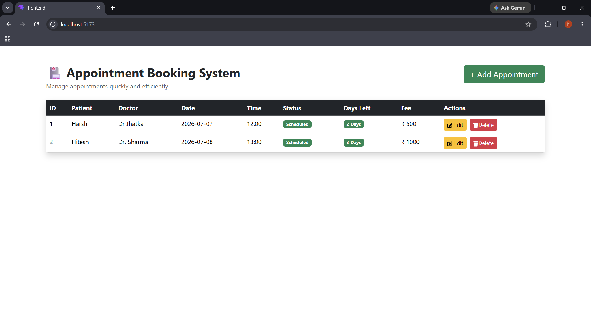

# 🏥 Appointment Booking System - Frontend

A modern React-based frontend for the Appointment Booking System. This application allows users to manage appointments with an intuitive and responsive interface.

## 🚀 Features

- ➕ Add new appointments
- ✏️ Edit existing appointments
- 🗑️ Delete appointments with confirmation modal
- 📅 Days Left calculation
- ✅ Status badges (Scheduled, Completed, Cancelled)
- 🔔 Toast notifications
- ✔️ Form validation
- 📱 Responsive Bootstrap UI

---

## 🛠️ Tech Stack

- React.js
- Vite
- Bootstrap
- React Bootstrap
- Axios
- React Toastify
- React Icons

---

## 📂 Folder Structure

```
src/
│── components/
│   ├── AppointmentForm.jsx
│   ├── AppointmentTable.jsx
│   └── DeleteModal.jsx
│
│── services/
│   └── api.js
│
│── App.jsx
│── main.jsx
```

---

## ⚙️ Installation

Clone the repository

```bash
git clone https://github.com/himeshnama007/appointment-booking-system-frontend.git
```

Go to project folder

```bash
cd appointment-booking-system-frontend
```

Install dependencies

```bash
npm install
```

Run the application

```bash
npm run dev
```

Frontend runs on:

```
http://localhost:5173
```

---

## 🔗 Backend Repository

Backend API:

```
http://localhost:5000
```

Backend Repository:

https://github.com/himeshnama007/appointment-booking-system-backend

---
## 📸 Screenshots

### Home Page



---

## 👨‍💻 Author

**Himesh Nama**

GitHub:
https://github.com/himeshnama007
